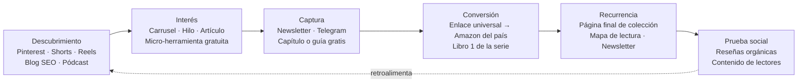
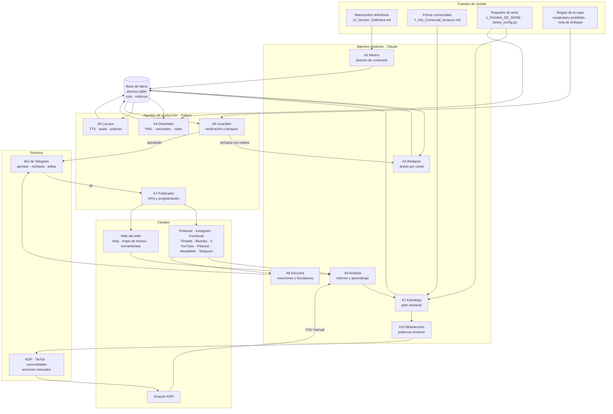
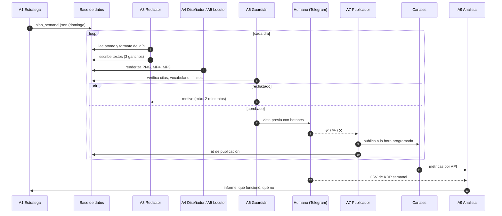
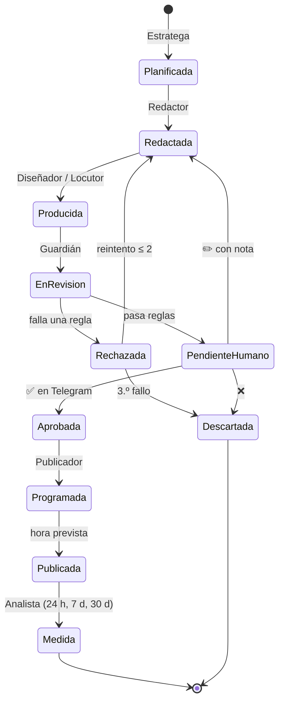
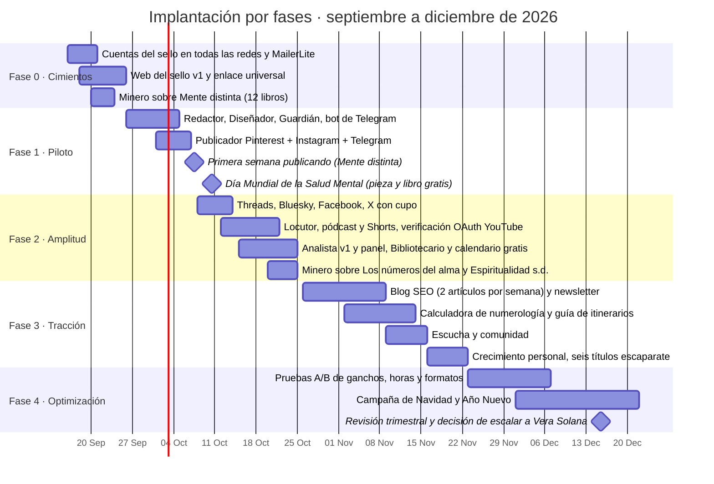

# Plan de marketing con agentes de IA — Sello Kai Zen (y reutilizable para Vera Solana y Ballabriga & Zaplana)

**Fecha:** 15 de septiembre de 2026
**Objetivo:** mover y vender en Amazon las series del sello **Kai Zen** (63 títulos en 6 series publicables) con un sistema de agentes de IA que produce, revisa, publica y mide contenido en redes y otros canales, con **coste monetario cercano a cero**. El único gasto previsto es el de la IA que desarrolla y opera los agentes.
**Alcance:** este documento define la estrategia, la arquitectura de agentes, las webs y apps a desarrollar, el calendario de implantación, los costes, los indicadores y las líneas rojas. No contiene código; es el documento del que saldrá el código.

> **Supuesto de partida.** La «serie de libros» a promocionar se interpreta como el catálogo Kai Zen de `8.Espiritualidad`, que es el más reciente, el más numeroso y el único que ya tiene material comercial (ficha, A+, copys). Toda la arquitectura se diseña **por sello**: el mismo sistema, con otra configuración, sirve para el catálogo romántico de *Vera Solana* y para la bibliografía de *Ana Ballabriga y David Zaplana*.

---

## 0. Resumen ejecutivo

1. **El producto es la serie, no el libro.** Amazon paga con visibilidad a quien tiene catálogo, orden de lectura y cadencia. Kai Zen ya tiene las tres cosas; lo que falta es tráfico externo constante y un embudo que lo convierta en lectores recurrentes.
2. **La materia prima ya está escrita.** 63 manuscritos definitivos son varios miles de fragmentos citables, micro-lecciones y preguntas. Un agente los extrae; otros los convierten en formato de red. No se inventa nada: **todo lo publicado procede del libro y se verifica contra él**.
3. **Canales gratuitos elegidos por rendimiento en no ficción de crecimiento personal**, en este orden: Pinterest (tráfico evergreen a búsquedas), Instagram (carruseles y reels), YouTube Shorts + pódcast (audio de cinco minutos), newsletter propia (activo que nadie puede quitar), blog SEO en la web del sello, Threads/Bluesky/X (texto corto), Telegram (canal de lectores) y las palancas internas de Amazon (días gratis de KDP Select, ofertas relámpago, rotación de palabras clave).
4. **Nueve agentes** organizados como una redacción: Estratega, Minero, Redactor, Diseñador, Locutor, Guardián, Publicador, Escucha y Analista, más un décimo especializado en Amazon (Bibliotecario). Un humano aprueba en un canal de Telegram con un toque; el resto es automático.
5. **Cuatro desarrollos web/app**, todos en alojamiento gratuito: la web del sello con blog y mapa de lectura, un enlace universal geolocalizado hacia el Amazon de cada país, un panel de control estático y una familia de micro-herramientas gratuitas (calculadora numerológica, guía «¿por qué libro empiezo?») que captan búsquedas y suscriptores.
6. **Coste:** 0 € en plataformas. Entre 3 y 12 € al mes de API de Claude si se opta por operación autónoma; 0 € marginal si los agentes creativos se ejecutan con Claude Code bajo la suscripción existente. Dominio propio opcional, unos 10 € al año.
7. **Implantación en 12 semanas**, empezando por una sola serie (*Mente distinta*) y dos canales, y escalando solo lo que mida bien.

---

## 1. Punto de partida

### 1.1 Catálogo a promocionar

| Serie | Nombre en Amazon | Títulos | Estado | Papel en el plan |
|---|---|---|---|---|
| 1.Neurodivergente | **Mente distinta** | 12 | Cerrada, páginas finales puestas | **Piloto.** Nicho con comunidad muy activa en redes (TDAH adulto, alta sensibilidad, diagnóstico tardío) |
| 3.Numerologia | **Los números del alma** | 13 | Cerrada, paquete completo con copys | Segunda ola. Enorme volumen de búsqueda; admite herramienta web gratuita |
| 6.Espiritualidad sin doctrina | **Espiritualidad sin doctrina** | 4 | Publicable | Puente hacia *Los Mensajeros* |
| 0.Crecimiento Personal | **Crecimiento personal** | 21 | Publicable por tandas | Volumen. Seis títulos escaparate elegidos por búsqueda |
| 2. Los mensajeros | **Los Mensajeros** | 11 | Cerrada | Ficción histórico-espiritual; público distinto, tono narrativo |
| 4/5 | Las Visionarias / El trabajo interior | 1 + 1 | Falta el segundo título | Fuera del plan hasta tener dos |
| 7. Los videntes | Los Videntes | 0 de 6 | En producción | Lanzamiento futuro con el sistema ya rodado |

### 1.2 Activos que ya existen y el plan reutiliza

- Para cada libro: `11_Version_Definitiva.md` (fuente de todo el contenido), `7_Info_Comercial_Amazon.md` (posicionamiento, palabras clave, advertencias de lo que no se puede prometer), portadas ES y EN.
- Para cada serie: `1_PAGINA_DE_SERIE.md` (descripción, bloques, itinerarios), `2_CONTENIDO_A_PLUS.md`, imágenes A+, fila de lomos, mapa de lectura, paleta en `series_config.py`.
- Serie 3 además: `5_COPYS_MARKETING.md` (frases ancla, posts, newsletter, FAQ). **Es la plantilla del formato que el agente Redactor debe producir para las demás series.**
- Una prueba de concepto de contenido para redes en `Libro1_La_importancia_del_autoconocimiento/RRSS/` (imagen, vídeo, música).
- Las reglas de la casa: sin promesas de salud, sin «bestseller», sin datos inventados, «se dice de qué trata el libro, no qué le hace al lector». Estas reglas se convierten en código en el agente Guardián.

### 1.3 Lo que no existe todavía

- Cuentas del sello en redes, newsletter, web propia, enlace universal.
- Un almacén de fragmentos citables (átomos de contenido) verificados.
- Un calendario de promociones de Amazon coordinado con el contenido externo.
- Medición: de dónde viene cada clic y qué vende.

---

## 2. Estrategia

### 2.1 El embudo



**Regla:** cada pieza publicada lleva un único destino medible: o la web del sello (que a su vez lleva a Amazon con UTM) o el enlace universal directo. Nunca un enlace desnudo de Amazon sin seguimiento.

### 2.2 Posicionamiento por serie (lo que diferencia y se repite hasta el cansancio)

| Serie | Promesa honesta | Frase paraguas | Enemigo declarado |
|---|---|---|---|
| Mente distinta | Sistemas en lugar de fuerza de voluntad; herramientas que funcionan un día malo | «Ni un test. Ni una vez "es un superpoder".» | La autoayuda que diagnostica y el discurso del «don» |
| Los números del alma | Un lenguaje simbólico para mirarse con claridad, sin predecir ni prometer | «Aquí no se predice, no se diagnostica y no se promete nada.» | El oráculo y los códigos de «sanación» |
| Crecimiento personal | Calma práctica sin épica | «Leer más no es hacer más.» | La motivación gritona |
| Espiritualidad sin doctrina | Espiritualidad sin pertenencia obligatoria | «Creer sin perder la cabeza.» | El dogma y el gurú |
| Los Mensajeros | Novelas sobre quienes cambiaron la forma de creer | «Ni burla ni adhesión.» | La hagiografía y la caricatura |

La **honestidad es el producto**. En un nicho saturado de promesas, «lo que este libro se niega a decir» es el gancho más diferenciador y, además, el único compatible con las reglas de la casa y con las normas de Amazon y Meta sobre afirmaciones de salud.

### 2.3 Canales, coste real y modo de operación

| Canal | Por qué | API / automatización | Coste | Modo |
|---|---|---|---|---|
| **Pinterest** | Buscador visual evergreen; las citas de crecimiento personal son su categoría estrella; un pin vive meses | API oficial gratuita (acceso de prueba sobre la cuenta propia; acceso estándar previa revisión gratuita) | 0 € | Automático |
| **Instagram** | Carruseles y reels; comunidad neurodivergente muy activa | Instagram API con inicio de sesión de Instagram para cuentas profesionales; límite de 100 publicaciones por API cada 24 h | 0 € | Automático |
| **Facebook (página)** | Público 40-65, el de Crecimiento personal y Segundas oportunidades | Graph API gratuita | 0 € | Automático |
| **Threads** | Texto corto con alcance orgánico alto en 2025-2026 | API oficial gratuita | 0 € | Automático |
| **Bluesky / Mastodon** | Sin revisión, sin límites relevantes; público lector | AT Protocol / API Mastodon, gratuitas | 0 € | Automático |
| **X** | Alcance residual pero útil para hilos | Capa gratuita solo escritura, unas 500 publicaciones al mes por app (verificar el límite vigente el día de la implantación) | 0 € | Automático con cupo |
| **YouTube Shorts** | Descubrimiento; el audio de cinco minutos funciona muy bien en espiritualidad | Data API gratuita con cuota diaria de 10.000 unidades (unas 6 subidas al día); los proyectos sin verificar publican en privado hasta pasar la verificación OAuth, que es gratuita | 0 € | Automático tras verificación; manual antes |
| **TikTok** | Máximo alcance orgánico en 18-35 | Content Posting API gratuita, pero las apps sin auditar publican solo en privado | 0 € | **Semiautomático:** el agente entrega vídeo y texto; un humano sube |
| **Pódcast** («Kai Zen, cinco minutos») | Spotify y Apple como buscadores; audio derivado del libro | Spotify for Creators, alojamiento y distribución gratuitos; RSS a Apple | 0 € | Automático (generación) + subida por RSS |
| **Newsletter** | El único activo propio; base de lanzamientos | MailerLite plan gratuito: hasta 500 suscriptores y 12.000 correos al mes, con automatizaciones, formularios y API | 0 € hasta 500 suscriptores | Automático |
| **Telegram** (canal + bot) | Canal de lectores y **panel de aprobación** del sistema | Bot API gratuita e ilimitada | 0 € | Automático |
| **Blog SEO** (web del sello) | Búsquedas de larga cola («ceguera temporal», «número de vida») que viven años | Cloudflare Pages o GitHub Pages, gratuitos | 0 € (dominio opcional ~10 €/año) | Automático (generación) + aprobación |
| **Reddit, grupos de Facebook, Quora, Goodreads** | Comunidades con reglas estrictas contra el spam | Sin automatizar la publicación | 0 € | **Solo humano**, con borradores del agente Escucha |
| **Amazon** (KDP Select, ofertas, A+, palabras clave, Author Central) | Las palancas internas mueven más que cualquier red | Sin API pública para informes; exportación manual de CSV | 0 € | Semiautomático: el agente prepara, el humano ejecuta en KDP |

**Descartados por coste o por normas:** anuncios de Amazon, Meta y BookBub (de pago); servicios de reseñas (prohibidos por Amazon); bots de seguir/dejar de seguir y mensajes directos masivos (prohibidos por las plataformas y contraproducentes); listados de pago de ofertas Kindle.

### 2.4 Palancas internas de Amazon que no cuestan nada

- **Días gratis de KDP Select.** Cada libro inscrito tiene 5 días gratuitos por cada periodo de 90. Con 63 títulos, el sello puede tener **un libro gratis casi cada día del año** sin repetir. El agente Bibliotecario construye ese calendario rotatorio y el resto del sistema publica alrededor de él: el libro gratis del día siempre es la «puerta» que lleva a la serie completa.
- **Ofertas relámpago Kindle** para el Libro 1 de cada serie en las fechas señaladas del nicho.
- **Precio del Libro 1** como anzuelo (0,99 €) y el resto de la serie a precio completo; la página final de colección y el mapa de lectura hacen el trabajo de venta cruzada.
- **Palabras clave y categorías**: rotación trimestral basada en las búsquedas que el Analista detecte en Pinterest, YouTube y el blog.
- **Contenido A+ y página de serie**, ya preparados: subirlos por orden de puertas de entrada, como marca el procedimiento.
- **Author Central** con biografía, foto de sello y enlace a la web.

### 2.5 Calendario editorial (ritmo semanal por serie activa)

| Día | Pieza | Canal principal | Reutilización |
|---|---|---|---|
| Lunes | Carrusel de 7 páginas: una idea del libro desarrollada | Instagram, Facebook | Pines individuales por página; hilo en Threads/Bluesky/X |
| Martes | Cita ilustrada (frase ancla verificada) | Pinterest ×3, Instagram historia | Telegram |
| Miércoles | Audio de cinco minutos | Pódcast, YouTube Shorts (60 s recortados) | Reel, TikTok |
| Jueves | Artículo SEO de 900-1.200 palabras | Blog | Newsletter del viernes; hilo |
| Viernes | Newsletter | MailerLite | Post fijado en Telegram |
| Sábado | «El de la honestidad»: qué se niega a decir la colección | Threads, Bluesky, X | Reel de texto |
| Domingo | Libro gratis del día siguiente / oferta | Todos, versión corta | — |

Con dos series activas, el volumen se duplica pero el sistema es el mismo. Un humano dedica **20-40 minutos al día** a aprobar en Telegram y a lo que solo puede hacer un humano (responder, subir a TikTok, tocar KDP).

---

## 3. Arquitectura del sistema de agentes

### 3.1 Vista general



**Dos capas deliberadas.**
- **Capa creativa (Claude).** Todo lo que requiere criterio: extraer, redactar, decidir, analizar. Se implementa como **agentes de Claude Code** (`.claude/agents/*.md`) que se ejecutan con la suscripción existente, o como llamadas a la API de Claude si se quiere operación sin ordenador encendido.
- **Capa de producción (Python determinista).** Todo lo que debe ser reproducible y barato: renderizar, sintetizar voz, verificar por reglas, publicar, medir. Sin modelo de lenguaje en el camino crítico de publicación: **un agente de IA nunca publica directamente**; publica un script después de la aprobación.

### 3.2 Los agentes, uno por uno

#### A1 · Estratega
- **Cuándo:** una vez por semana (domingo noche) y a demanda.
- **Entradas:** catálogo y estado de series, calendario de promociones de Amazon, fechas señaladas del nicho (Día Mundial de la Salud Mental, semana del TDAH, vuelta al trabajo en septiembre, Año Nuevo, Navidad), informe del Analista, inventario de átomos aún no usados.
- **Salida:** `plan_semanal.json`: para cada día, qué serie, qué libro, qué átomo, qué formato, qué canal, qué llamada a la acción y qué destino con UTM. Reparte el peso entre series según objetivo (lanzar, sostener, reactivar).
- **Reglas:** nunca más del 30 % de piezas «de venta»; el resto aporta valor sin pedir nada. Cada semana al menos una pieza «de honestidad» por serie. Coordina la pieza del domingo con el libro gratis del lunes.

#### A2 · Minero de contenido
- **Cuándo:** una vez por libro (al incorporarlo) y cuando el inventario baja.
- **Entradas:** `11_Version_Definitiva.md`.
- **Salida:** átomos en `atomos.sqlite`, cada uno con: tipo (cita literal, micro-lección, pregunta, contraste «no es X, es Y», herramienta de tres pasos, escena de apertura), texto exacto, capítulo, libro, serie, temas, intensidad emocional, y una **huella** (posición y hash del fragmento) para que el Guardián pueda comprobar que existe.
- **Reglas:** citas literales sin retocar; micro-lecciones parafraseadas marcadas como tales; nunca inventar cifras, estudios o nombres. Un libro de 60.000 palabras produce entre 40 y 80 átomos útiles; el catálogo, más de 3.000.

#### A3 · Redactor multicanal
- **Cuándo:** diario, sobre el plan semanal.
- **Entradas:** átomo + guía de voz de la serie + formato objetivo.
- **Salida:** un paquete por pieza: texto de carrusel (7 páginas: gancho, desarrollo, remate y llamada), guion de reel o short de 30-45 segundos con marcas de tiempo, título y descripción de pin (con palabras clave de búsqueda), versión corta para Threads/Bluesky/X, texto de Facebook, guion de audio de cinco minutos, artículo SEO, correo de newsletter. Todo en el registro de la serie.
- **Reglas:** habla de qué trata el libro, nunca de lo que le hará al lector. Sin urgencia falsa. Sin emojis en Kai Zen salvo el escaparate de picante en Vera Solana. Llamada a la acción única. Genera **tres ganchos alternativos** por pieza para que el Analista pueda medir cuál funciona.

#### A4 · Diseñador
- **Cuándo:** tras el Redactor.
- **Cómo:** plantillas HTML/CSS por serie (paleta, tipografía y motivo tomados de `series_config.py` y de las portadas), renderizadas a PNG con Playwright. Formatos: 1080×1350 (carrusel), 1000×1500 (pin), 1080×1920 (historia y fondo de vídeo). Vídeo: tipografía cinética sobre fondo de serie con ffmpeg, subtítulos quemados, voz del Locutor y música propia ya generada.
- **Reglas:** tipografía con los glifos comprobados (la lección de las flechas y los checks en Georgia). Portada del libro siempre visible en la última página del carrusel y en el pin. Nada de imágenes de personas reales generadas por IA.

#### A5 · Locutor
- **Cuándo:** para audios, shorts y pódcast.
- **Cómo:** síntesis de voz neuronal gratuita (Edge TTS, voces en español de España y neutro; alternativa local con Piper). Normalización de volumen, pausas, música de fondo a -18 dB. Publica el episodio de cinco minutos con RSS a Spotify for Creators y recorta 60 segundos para Shorts y Reels.
- **Reglas:** el audio es lectura o adaptación breve del libro, con crédito al título y a la serie al principio y al final. Se declara que la voz es sintética en la descripción.

#### A6 · Guardián
- **Cuándo:** antes de cualquier publicación. Sin su sello nada sale.
- **Comprobaciones deterministas (Python):**
  1. Vocabulario prohibido por serie y en dos idiomas: cura, sana, trata, reduce, mejora, calma, garantiza, transforma tu vida, bestseller, más vendido, premio, y la lista completa del procedimiento.
  2. **Cada cita marcada como literal existe en el manuscrito** (búsqueda exacta contra `11_Version_Definitiva.md`). Si no existe, se bloquea.
  3. Cifras, fechas, nombres de estudios: si aparecen y no están en el manuscrito, se bloquea.
  4. Límites de la plataforma: longitud, número de etiquetas, proporción de imagen, duración de vídeo.
  5. Enlace con UTM presente y correcto; nota de enfoque presente en piezas de *Mente distinta* que toquen salud mental; teléfonos de ayuda (024, 112, 016) donde el manuscrito los pone.
  6. Cupo diario por canal (para no agotar la capa gratuita de X ni la cuota de YouTube).
- **Comprobación de criterio (Claude, segunda opinión):** deriva de tono, promesa implícita, frase que pueda leerse como diagnóstico o consejo médico, humor fuera de registro.
- **Salida:** aprobado → cola de aprobación humana; rechazado → vuelve al Redactor con el motivo, máximo dos intentos, luego se descarta y se anota.

#### A7 · Publicador
- **Cuándo:** según programación, solo con piezas aprobadas por Guardián y humano.
- **Cómo:** un conector por canal (Pinterest, Instagram, Facebook, Threads, Bluesky, Mastodon, X, YouTube, Telegram, MailerLite, RSS del pódcast, repositorio del blog). Reintentos con espera, registro de identificador de publicación, idempotencia (una pieza no se publica dos veces).
- **Reglas:** horas de publicación por canal y país (España, México, Argentina, Colombia; el Analista las afina). Ningún mensaje directo automático. Ninguna acción sobre cuentas de terceros.

#### A8 · Escucha y comunidad
- **Cuándo:** varias veces al día.
- **Cómo:** lee comentarios y menciones de las cuentas propias por API; busca palabras clave del nicho en Bluesky, Threads y Reddit (solo lectura); detecta preguntas a las que un libro responde; vigila reseñas nuevas en Amazon (comprobación manual asistida o exportación) y las clasifica.
- **Salida:** borradores de respuesta al humano por Telegram, con enlace directo para publicarlos con un toque. Oportunidades semanales para el Estratega («esta semana se habla mucho de ceguera temporal»). Reseñas negativas con motivo recurrente → aviso editorial.
- **Reglas:** nunca publica en comunidades ajenas. Nunca responde a una reseña. Nunca pide reseñas a cambio de nada. Responde a quien pregunta, no a quien no ha preguntado.

#### A9 · Analista
- **Cuándo:** diario (recogida) y semanal (informe).
- **Entradas:** métricas por API (Instagram Insights, YouTube Analytics, Pinterest Analytics, MailerLite, Telegram), clics en el enlace universal por país y campaña, tráfico del blog, y el CSV de KDP que el humano descarga cada semana (ventas, KENP, gratuitos descargados).
- **Salida:** informe semanal en Markdown y un panel HTML estático: qué series, átomos, ganchos, formatos y horas funcionan; coste por suscriptor; correlación entre piezas y ventas del día siguiente. Propuestas concretas al Estratega y al Bibliotecario.

#### A10 · Bibliotecario de Amazon
- **Cuándo:** semanal y por lanzamiento.
- **Salida:** calendario rotatorio de días gratis y ofertas para los 63 títulos; sugerencias de palabras clave y categorías por libro con datos del Analista; orden de subida de A+ y páginas de serie; checklist de Author Central; borradores de descripción para los libros que aún no la tienen. Todo listo para copiar y pegar en KDP.
- **Reglas:** nunca toca KDP; el humano ejecuta. Vigila la coherencia carácter por carácter de nombre de serie y número de orden en ebook y papel.

### 3.3 Ciclo semanal



### 3.4 Ciclo de vida de una pieza



### 3.5 Infraestructura, toda gratuita

| Necesidad | Solución | Coste |
|---|---|---|
| Ejecución programada | **Opción A:** Windows Task Scheduler en el PC actual llamando a Claude Code en modo no interactivo y a los scripts Python. **Opción B:** GitHub Actions con cron en repositorio privado (2.000 minutos al mes gratuitos; sobra) | 0 € |
| Código y estado | Repositorio Git privado; `atomos.sqlite` y `cola.sqlite` versionados o en Cloudflare D1 (gratuito) | 0 € |
| Secretos (tokens de APIs) | GitHub Secrets o fichero local cifrado; nunca en el repositorio | 0 € |
| Renderizado de imágenes | Playwright + Chromium en local o en Actions | 0 € |
| Vídeo y audio | ffmpeg, Edge TTS o Piper | 0 € |
| Web y blog | Astro o HTML estático en Cloudflare Pages o GitHub Pages | 0 € |
| Enlace universal | Cloudflare Worker (100.000 peticiones al día gratis) | 0 € |
| Newsletter | MailerLite gratuito hasta 500 suscriptores | 0 € |
| Pódcast | Spotify for Creators | 0 € |
| Aprobación y avisos | Bot de Telegram | 0 € |
| Modelo de lenguaje | Claude Code con la suscripción actual (Opción A) o API de Claude con Haiku 4.5 para extracción y Sonnet 5 para redacción (Opción B) | 0 € o 3-12 €/mes |
| Dominio propio | Opcional; `kaizen-libros.es` o similar | ~10 €/año |

**Estimación de la Opción B (API).** Unas 40 piezas a la semana, cada una con extracción, redacción, tres ganchos y revisión de criterio: entre 150.000 y 300.000 tokens semanales. Con Haiku 4.5 para el Minero y el Guardián y Sonnet 5 para el Redactor y el Estratega, el coste queda por debajo de 12 € al mes en el peor caso. La extracción inicial de los 63 libros (una sola vez) ronda los 3-6 €.

### 3.6 Estructura del repositorio propuesta

```
Promocion_IA/
├── PLAN_MARKETING_AGENTES_IA.md      ← este documento
├── config/
│   ├── sellos/kaizen.yaml            ← series, paletas, voz, cuentas, UTM
│   ├── sellos/verasolana.yaml        ← mismo esquema, otro sello
│   ├── prohibido_es.txt · prohibido_en.txt
│   └── fechas_nicho.yaml
├── .claude/agents/                   ← capa creativa (Claude Code)
│   ├── estratega.md · minero.md · redactor.md
│   ├── guardian-criterio.md · analista.md · bibliotecario.md · escucha.md
├── agentes/                          ← capa de producción (Python)
│   ├── minero_indexar.py             ← genera huellas verificables
│   ├── disenador/ (plantillas HTML por serie, render.py, video.py)
│   ├── locutor/ (tts.py, podcast_rss.py)
│   ├── guardian/ (reglas.py, verificar_citas.py, cupos.py)
│   ├── publicador/ (pinterest.py, instagram.py, threads.py, bluesky.py, x.py, youtube.py, telegram.py, mailerlite.py, blog.py)
│   ├── escucha/ (menciones.py, busquedas.py)
│   └── analista/ (recoger.py, informe.py, panel.py)
├── bot_telegram/                     ← cola de aprobación
├── web/                              ← Astro: sello, series, libros, blog, herramientas
├── worker_enlaces/                   ← Cloudflare Worker del enlace universal
├── datos/ (atomos.sqlite, cola.sqlite, metricas.sqlite)
└── .github/workflows/ (diario.yml, semanal.yml)
```

---

## 4. Webs y apps a desarrollar

### W1 · Web del sello Kai Zen
- **Qué es:** sitio estático rápido con una página por serie (descripción, bloques, itinerarios, mapa de lectura, «empieza por el Libro 1»), una página por libro (ficha, extracto, botón al enlace universal), página de autor/sello, blog SEO y una página «enlace en bio» que sustituye a Linktree.
- **Por qué:** es el único lugar que el sello controla; convierte búsquedas de Google en suscriptores y ventas durante años; da a Amazon una señal de tráfico externo, que el algoritmo premia.
- **Alimentación:** el Redactor genera artículos a partir de los libros (nunca el capítulo entero); el Publicador los sube al repositorio y Cloudflare Pages despliega.
- **Formulario de captura:** MailerLite incrustado, con un regalo de bienvenida por serie (guía breve en PDF derivada del libro 1, por ejemplo «Diez sistemas que aguantan un día malo»).

### W2 · Enlace universal geolocalizado
- **Qué es:** `enlace.dominio/mente-1` detecta el país del visitante, lo envía al Amazon correcto (.es, .com, .com.mx, .com.ar vía .com) con UTM y registra el clic anónimo (país, campaña, canal, día).
- **Por qué:** un solo enlace en todas las redes; medición de origen sin coste; sin depender de acortadores de terceros que caducan o meten publicidad.
- **Opcional:** enlaces de Amazon Afiliados donde el programa lo permita, que aportan seguimiento de conversiones y una pequeña comisión sobre compras referidas (comprobar las condiciones del programa en cada país; las compras propias quedan excluidas).

### W3 · Panel de control y cola de aprobación
- **Bot de Telegram:** recibe cada pieza con vista previa e imagen, y tres botones: aprobar, editar (abre una nota que vuelve al Redactor), rechazar. Avisa de menciones, reseñas nuevas y errores de publicación.
- **Panel HTML estático:** generado por el Analista cada semana: embudo por serie, mejores piezas, ganchos ganadores, clics por país, suscriptores, ventas y KENP con el CSV de KDP, calendario de promociones.

### W4 · Micro-herramientas gratuitas (imán de tráfico y suscriptores)
| Herramienta | Serie | Qué hace | Por qué funciona |
|---|---|---|---|
| **Calculadora de numerología** | Los números del alma | Número de vida, expresión y alma a partir de nombre y fecha, con la explicación del libro y su regla («no predice») | «Calcular número de vida» tiene un volumen de búsqueda enorme y casi ninguna herramienta en español honesta; cada resultado enlaza al libro correspondiente |
| **«¿Por qué libro empiezo?»** | Todas | Conversación breve (Claude API, céntimos) que recomienda un itinerario y un Libro 1 según lo que la persona cuenta | Convierte la duda de catálogo en una compra concreta; guarda la regla de no diagnosticar |
| **Temporizador para mentes distintas** | Mente distinta | Temporizador visual con bloques cortos y «reconstruible en diez minutos», tal como lo describe el libro 3 | Herramienta útil, compartible y citada en el propio libro |
| **Generador de «carta a mi yo del futuro»** | Crecimiento personal (Libro 21) | Escribe y programa un correo a uno mismo con MailerLite | Capta correo con valor real y sin truco |

Cada herramienta es una página estática (más una función pequeña en Cloudflare Worker donde haga falta), lleva el sello, el libro de origen y el formulario de suscripción.

---

## 5. Calendario de implantación (12 semanas)



**Criterios para pasar de fase** (los decide el Analista con datos, no la sensación):
- Fase 1 → 2: dos semanas seguidas publicando sin intervención manual salvo el toque de aprobación; cero bloqueos del Guardián por citas inexistentes en la última semana.
- Fase 2 → 3: al menos 100 clics semanales en el enlace universal y los primeros 50 suscriptores.
- Fase 3 → 4: una pieza o herramienta que genere tráfico orgánico de búsqueda por sí sola.

---

## 6. Indicadores

| Nivel | Indicador | Objetivo a 90 días (conservador) | Fuente |
|---|---|---|---|
| Producción | Piezas publicadas por semana | 25-40 | cola.sqlite |
| Calidad | Rechazos del Guardián por pieza | < 0,2 | Guardián |
| Alcance | Impresiones semanales (suma de canales) | 20.000 | APIs de insights |
| Tráfico | Clics en enlace universal por semana | 300 | Worker |
| Captura | Suscriptores newsletter y Telegram | 150 | MailerLite, Telegram |
| Conversión | Ventas + descargas gratis + KENP por semana | tendencia creciente 4 semanas seguidas | CSV de KDP |
| Recurrencia | % lectores del Libro 1 que compran el 2 | medible en KDP por serie | CSV de KDP |
| Prueba social | Reseñas orgánicas nuevas al mes | 5-10 en el conjunto | Amazon |
| Coste | Euros gastados al mes | ≤ 12 € | facturación API |

Lo que **no** se mide como éxito: seguidores. Es la métrica más fácil de inflar y la que menos vende.

---

## 7. Riesgos y líneas rojas

### 7.1 Líneas rojas (el Guardián las hace cumplir; no se negocian)
1. **Nada de reseñas incentivadas, compradas, intercambiadas o escritas por el sistema.** Es motivo de cierre de cuenta en Amazon.
2. **Nada de automatizar interacción con terceros:** ni seguir, ni dejar de seguir, ni mensajes directos, ni comentarios en cuentas ajenas, ni publicar en comunidades. Las plataformas lo detectan y el nicho lo castiga.
3. **Nada de afirmaciones de salud ni de resultados.** Ni en Kai Zen ni en su traducción. Ni «reduce la ansiedad» ni «mejora tu concentración». Meta y Amazon las restringen y la casa las prohíbe.
4. **Nada inventado:** ni citas, ni cifras, ni estudios, ni testimonios. Toda cita literal se verifica contra el manuscrito.
5. **Declaración de IA donde la plataforma lo exige:** contenido asistido por IA en KDP, voz sintética en el pódcast, imágenes generadas cuando parezcan fotografía.

### 7.2 Riesgos y mitigación
| Riesgo | Mitigación |
|---|---|
| Cambian los límites o condiciones de una API gratuita | Conectores desacoplados; el Publicador degrada a «entregar al humano» si un canal falla. Las cifras de límites de este documento se comprueban el día de la implantación |
| Un canal cierra la cuenta por parecer automatizada | Ritmo humano (no más de 3-4 publicaciones diarias por canal), variación de horas, contenido distinto por canal, respuestas humanas |
| La persona autor «Kai Zen» | La biografía actual cuenta una vida concreta (infancia, viajes a Japón, India y Tíbet) que en redes, en primera persona y a diario, se convierte en afirmaciones verificables. **Recomendación:** tratar Kai Zen como **voz de sello**, no como persona con anécdotas; hablar de los libros y de las ideas, nunca de vivencias personales inventadas; sin retratos fotorrealistas presentados como el autor. Es la misma línea que ya fija el documento de Vera Solana: evocador, no falsificable |
| Fatiga del humano aprobador | Aprobación por lotes, plantillas de confianza que pasan con revisión ligera tras cuatro semanas sin incidencias, y un tope diario de piezas |
| Canibalización entre series | El Estratega reparte cuotas y evita dos series del mismo lector el mismo día |
| Contenido que revela demasiado libro | Máximo un 2 % de un libro publicado gratis en total; los átomos llevan contador de uso |

---

## 8. Reutilización para los otros sellos

| Sello | Cambios de configuración | Cambios de estrategia |
|---|---|---|
| **Vera Solana** (romántica) | Paleta y tipografía por serie; voz en primera persona cercana; emojis de picante; canales principales TikTok e Instagram; capítulo extra mensual como imán | Publicación rápida coordinada con el calendario de escritura; tropos como palabras clave; comunidad de lectoras («¿equipo quién?») |
| **Ana Ballabriga y David Zaplana** | Nombres reales, web existente, bibliografía con premio Indie 2016 y traducciones | Menos volumen y más autoridad: artículos sobre novela negra y Cartagena, presencia en medios y clubes de lectura, reactivación del fondo |

El código no cambia; cambia `config/sellos/<sello>.yaml`.

---

## 9. Primeras acciones concretas (esta semana)

1. Elegir y reservar el nombre de usuario del sello en Instagram, Pinterest, Threads, Bluesky, X, YouTube, TikTok, Telegram y MailerLite. Comprobar disponibilidad de dominio.
2. Crear el repositorio `Promocion_IA` con la estructura del apartado 3.6 y el fichero `config/sellos/kaizen.yaml` a partir de `0_SERIES_AMAZON.md` y `series_config.py`.
3. Ejecutar el Minero sobre los doce libros de *Mente distinta* y revisar a mano una muestra de 30 átomos.
4. Montar el bot de Telegram de aprobación (es el componente que desbloquea todo lo demás).
5. Publicar la web v1 con la página de *Mente distinta* y el enlace universal.
6. Pedir el acceso de prueba a la API de Pinterest y crear la app de Meta para Instagram y Threads (los dos trámites tardan días; cuanto antes, mejor).
7. Fijar en el calendario el **10 de octubre** (Día Mundial de la Salud Mental) como primera fecha señalada, con *No es pereza* gratis y el carrusel «Ni un test».

---

*Documento generado a partir del catálogo real en `8.Espiritualidad`, `3.2.Romantica_New_IA` y `Catalogo`. Las condiciones de las plataformas citadas son las conocidas a fecha de hoy y deben verificarse al implantar cada conector.*
